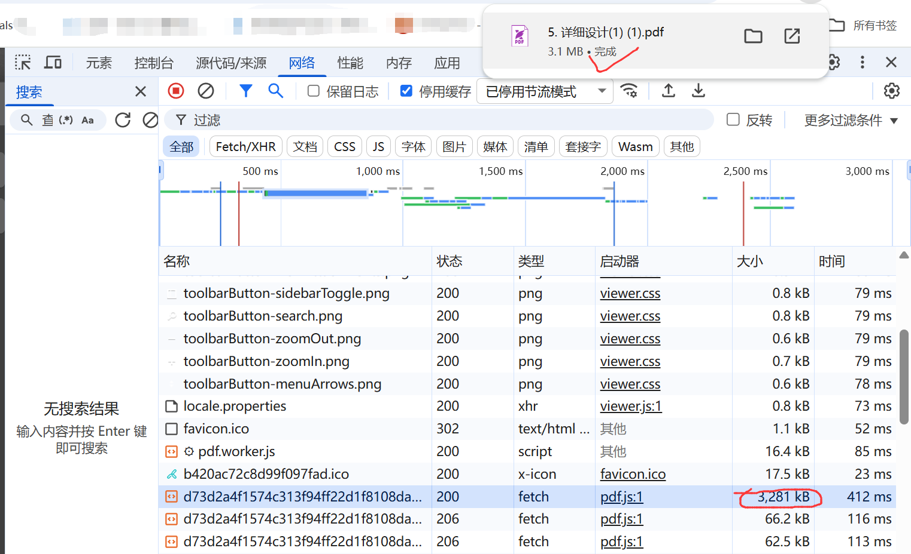
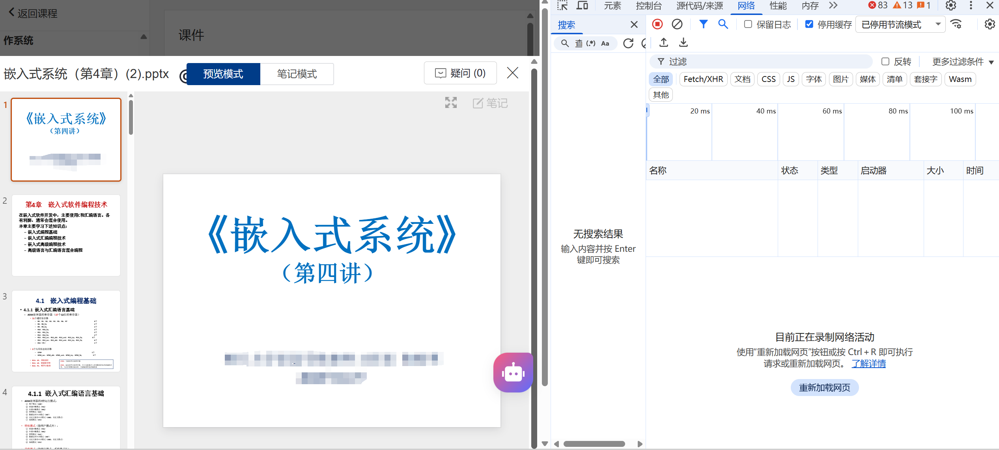
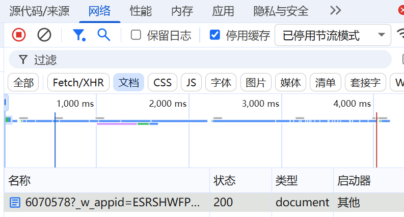
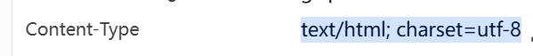
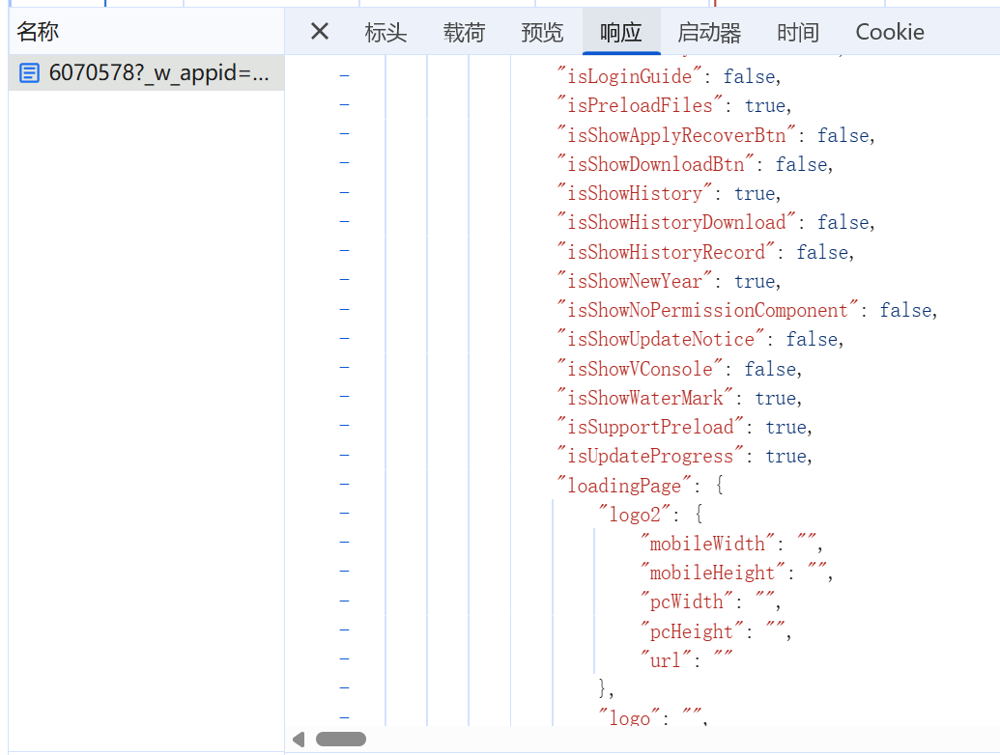

# 说明
- 合法性与道德：请确保仅在合法、合规和得到允许的情况下下载或保存内容，遵守网站使用条款与版权要求。
# 2026.1更新 
- 已有同学开发了数字教学平台资源下载的浏览器插件。对于原理比较感兴趣的同学可以阅读其源码，也可以按照下面的手动下载方法进行学习和实践。
- 指路[数字教学平台资源下载器](https://github.com/fish-can/TronClass-PDF-Downloader)
# 原始方案，手动下载
## 2025.10更新
经过测试，单数字平台的pdf可以下载到本地，而ppt文档等通过js动态加载，无法直接下载完整文件，如果有同学对这方面有研究且愿意分享，欢迎PR。

## 步骤
- f12打开开发者工具
- 选择Network栏
    
- 刷新页面
- 找到想下载的文件
  - 如何找：看文件名、后缀、大小。因为文件名一般会做混淆，所以后缀和大小比较重要，可以过滤器筛选后缀。实在不行穷举。
  
  - 在教务网站，一般pdf、zip文件是可以点击下载的而文档文件如果是指定让浏览器渲染显示，那就没办法直接通过链接下载。具体通过该链接的header
    - 查看Content-Type和Content-Disposition字段
    
    像这样的text/html就是被转换成网页显示了，而application/pdf就是可以直接下载的
- 右键Open in new tab（若能直接下载，到这步就结束了）
- 不能直接下载：
  - 方法一：打开“响应”，复制全部内容，粘贴到文本编辑器，另存为对应后缀的文件
  
  - 方法二：用cURL或Postman等工具，复制请求，带上header和cookie等信息，发送请求，保存响应内容
    - 在终端粘贴并执行。这部分细节请自行学习。
    ```bash
    curl 'https://example.com/file' -H 'Cookie: xxx' -H 'User-Agent: xxx' --output filename.ext
    ```
## 原理
- 浏览器与服务器通信基于 HTTP/HTTPS：页面上的下载行为最终对应一个或多个 HTTP 请求（GET/POST），请求返回的响应里包含文件数据或指向文件的地址。
- TLS/HTTPS：如果是 HTTPS，数据在传输层被加密，DevTools 仍能看到请求/响应头和已解密的内容（因为浏览器本地解密）。
- 请求链和发起者（Initiator）：很多下载由页面脚本（fetch/XHR）发起，DevTools 的 Initiator 能帮助追踪是哪个脚本触发的请求。
- 响应头判断文件类型：关注 Content-Type（例如 application/pdf、video/mp4、application/octet-stream）和 Content-Disposition（attachment; filename=...）以确认是真正的文件响应而非 HTML。
- Blob/对象 URL：一些页面先用 XHR/fetch 接收二进制数据再通过 URL.createObjectURL(blob) 生成 blob: 开头的临时地址，这类地址不能直接从别处访问。可在 Network 的 XHR/Fetch 响应中保存二进制内容，或在 Console 中获取对应 blob 并调用 link.click() 导出。
- 授权与 Cookie：受限资源通常依赖 Cookie、Session、Authorization header 或 Referer。直接在新标签打开 URL 时，浏览器会携带同站 Cookie；如果是复制的 cURL/外部工具，需同时带上相应头或 Cookie 才能访问。
- 防盗链与签名 URL：有的服务用签名参数（带过期时间的 token）或检查 Referer 来防止直接访问，签名过期后链接失效，需要在页面生成时抓取或复现签名流程。
- 分块/断点续传：大文件常用 Range 请求或分片上传/下载。Network 面板会显示 range 请求及响应状态（206 Partial Content）。
- 重定向与 CDN：文件 URL 可能会被重定向（302/307）到 CDN 节点；查看 Network 的重定向链可以得到最终下载地址。
- CORS 限制：跨域请求可能会被浏览器拦截（缺少 Access-Control-Allow-*），但直接在标签页打开纯文件通常不受 CORS 限制；脚本发起时受限。
- 调试技巧：
  - 在 Network 里过滤常见后缀（.pdf .mp4 .zip）或按大小降序查找大文件。
  - 右键请求可选择「Copy」→「Copy as cURL」以在终端复现请求（需带上 Cookie/headers）。
  - 对 blob 情况，可在 Console 查找创建 blob 的代码或在 Sources/Network 保存响应内容。